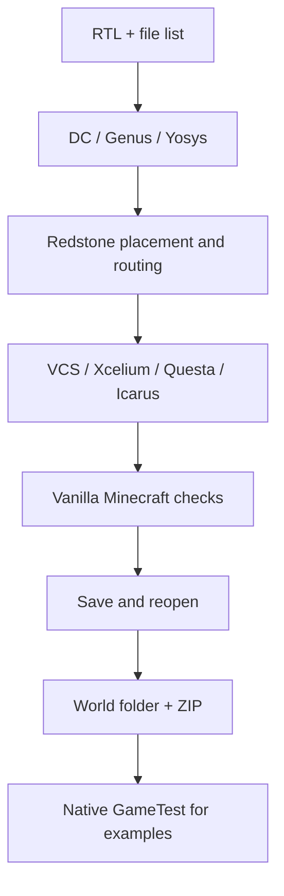

# RTL2MC

Convert a supported subset of SystemVerilog RTL into a working Minecraft
redstone circuit and export it as a Java Edition world folder or ZIP.

RTL2MC synthesizes logic, places and routes redstone macros, checks source and
routed simulation, then measures the circuit in an actual vanilla Minecraft
server. It saves and reopens the world before reporting success. A separate
native GameTest runner checks the four example designs against independent
reference models.



## Quick start

Use Python **3.12 or newer** and run commands from this repository's root.
The Python application and offline tests use only the standard library; a
`pip install` step is unnecessary. Keep the source and data directories together.

```sh
python rtl2mc.py doctor
python rtl2mc.py run -f examples/rtl/adder.f --synth yosys --sim icarus --plan
python tools/test.py
```

To build a world, provide Yosys, Icarus (`iverilog` and `vvp`), Java 21 and the
pinned Minecraft Java 1.21.1 server. RTL2MC can install missing supported open
tools and the server into `.local/rtl2mc/` after displaying a download plan.
Commercial tools require your own installation and licenses.

After reviewing the [Minecraft EULA](https://aka.ms/MinecraftEULA), use the
following command if you agree to it and approve the dependency downloads:

```sh
python rtl2mc.py run -f examples/rtl/adder.f --synth yosys --sim icarus --minecraft-version 1.21.1 --out builds/adder --install-missing --accept-minecraft-eula
```

An output directory must be new or empty. A successful run prints
`RTL2MC PASS` and produces:

| Output | Purpose |
|---|---|
| `builds/adder/world/` | Standalone Minecraft save |
| `builds/adder/adder-world.zip` | Save packaged for transfer |
| `builds/adder/run.json` | Stage results and tested coverage |
| `builds/adder/world-manifest.json` | World file hashes and ZIP checksum |
| `builds/adder/build/` | Snapshotted RTL, netlists, layout and timing |
| `builds/adder/verification/` | Minecraft measurements and reopen evidence |

Copy `world/` into your Minecraft Java **1.21.1** saves directory under a name
such as `rtl2mc_adder`, or extract the ZIP there. Open the save and read
`RTL2MC-README.txt` inside it for input controls, output readout and replay.

## Native Minecraft GameTest

GameTest opens a copy of the exported region files and checks actual blocks
and redstone outputs. Set up its checksum-pinned compiler and mappings once:

```sh
python tools/setup_gametest.py
python tools/setup_gametest.py --install
python tools/check_gametest.py builds/adder --out builds/adder-gametest --negative-control
```

The final command runs the positive example and deliberately removes an output
wire in another copy. That negative control must fail through a native GameTest
assertion. Results include `gametest.xml`, raw observations and JSON reports.
The harness uses the unmodified vanilla **1.21.1** engine with its native
development GameTest ticker enabled.

## Example designs and tool combinations

| Design | Behavior | Input/configuration |
|---|---|---|
| `adder` | One-bit full adder | [adder.f](examples/rtl/adder.f) |
| `mux2` | Two-input, one-bit multiplexer | [mux2.f](examples/rtl/mux2.f) |
| `counter` | Two-bit counter with synchronous reset and enable | [counter.f](examples/rtl/counter.f), [configuration](examples/rtl/counter.rtl2mc.json) |
| `shift2` | Two-bit serial shift register with reset and enable | [shift2.f](examples/rtl/shift2.f), [configuration](examples/rtl/shift2.rtl2mc.json) |

Synthesis and simulation are selected independently:

```sh
python rtl2mc.py run -f examples/rtl/counter.f --synth dc --sim icarus --out builds/dc-icarus-counter
python rtl2mc.py run -f examples/rtl/mux2.f --synth yosys --sim xcelium --out builds/yosys-xcelium-mux2
python rtl2mc.py run -f examples/rtl/shift2.f --synth genus --sim questa --out builds/genus-questa-shift2
```

The recorded Linux qualification covered **48 design/tool runs**: all four
designs across DC, Yosys and Genus, paired with VCS, Icarus, Xcelium and Questa.
All passed export, save/reopen and native GameTest checks, totaling **1,476
GameTest output-bit comparisons**. These are the original measured runs;
[validation details](docs/validation.md) distinguish that history from checks
of this reorganized source tree.

## Supported scope

- Binary combinational logic and one ungated, positive-edge clock.
- Synchronous reset and explicit boot transactions for sequential designs.
- NOR, inverter and flip-flop macros, with characterized repeater routing.
- A conservative router with a default limit of 64 mapped logic cells.
- Minecraft Java 1.21.1 is the measured baseline. Other selectable targets
  require their own successful physical regression; GameTest is pinned to 1.21.1.

Tristates, X/Z values, latches, asynchronous reset, multiple clocks and arbitrary
combinational feedback are outside the supported contract. Physical tests check
settled outputs and captured/held state. They do not prove unrestricted RTL,
transient equivalence or every physical state sequence. Icarus lacks native SDF
timing checks; its flow records that limitation and uses procedural guards.

## Repository map

| Path | Contents |
|---|---|
| `rtl2mc/`, `rtl2mc.py`, `rtl2mc.cmd` | Main application and entry points |
| `redstone_pdk/`, `pdk.py` | Shared geometry, router, models and laboratory tools |
| `examples/rtl/` | Small RTL designs, file lists and sequential configurations |
| `gametest/` | Native Java GameTest harness |
| `eda/`, `tools/` | Synthesis adapters, simulation, setup and regression commands |
| `technology/`, `schema/`, `catalog/`, `components/` | Minecraft target and component contracts |
| `cells/`, `connections/`, `models/`, `characterizations/`, `views/` | Measured model contracts and canonical EDA views |
| `tests/` | Self-contained tests and small fixtures |
| `tests/evidence/` | Optional audits of archived laboratory measurements |
| `docs/` | Usage, tool setup, testing and validation records |


## Documentation

- [Detailed CLI and RTL contract](docs/rtl2mc.md)
- [Tool setup and the supplied EDA module versions](docs/toolchains.md)
- [Tests, GameTest and the complete tool matrix](docs/testing.md)
- [Architecture and model provenance](docs/architecture.md)
- [Recorded validation](docs/validation.md)
- [PDK laboratory and optional evidence](docs/pdk-lab.md)
- [Contributing](CONTRIBUTING.md)
- [Apache-2.0 license](LICENSE) and [external dependencies](THIRD_PARTY_NOTICES.md)

## License

RTL2MC's original source code, documentation, examples and project-authored
model and circuit data are licensed under the **Apache License, Version 2.0**.
See [LICENSE](LICENSE) for the full terms and [NOTICE](NOTICE) for attribution.
Third-party tools and assets retain their own terms, described in
[THIRD_PARTY_NOTICES.md](THIRD_PARTY_NOTICES.md).
